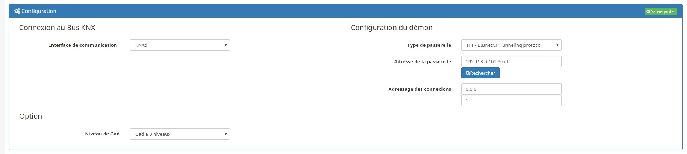
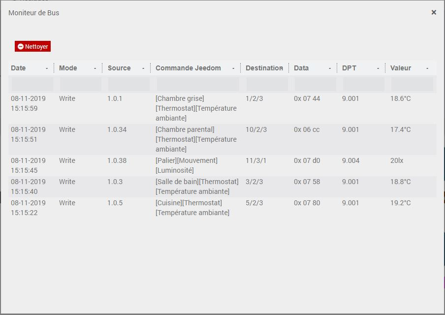
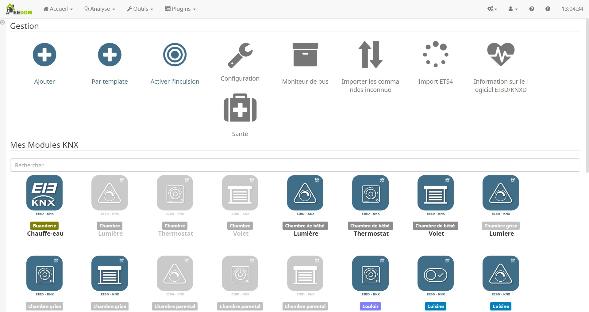
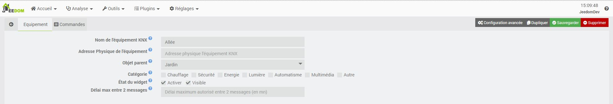
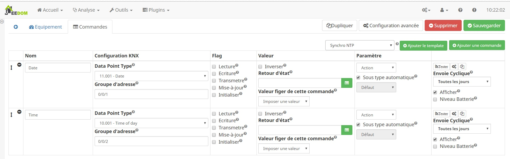
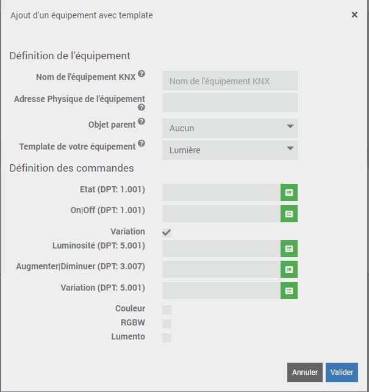

Description 
===========
Ce plugin permet de communiquer entre Jeedom avec votre installation KNX.
Jeedom deviendra donc un equipement de votre installation 
Des fonction d'auto-configuration (auto-include, parser ETS4) ont été implémenté pour permettre une mise en place rapide

Installation et configuration
===========

Configuration du plugin et de ses dépendances
---

* `Interface de communication` : Choisir l'interface par laquel nous allons nous connecter au bus
  * `KNXd` : Remplacent d'eibd mais pas encore suffisamenent stable 
  * `EIBD` : Recommandé
  * `Manuel` : si EIBD est installer sur une autre machine
  
### Manuel
* `Adresse IP` : Indiquez l'adresse IP de la machine sur lequel tourne EIBD.
* `Port` : Indiquez le port de connexion EIBD (Par défaut 6720)

### KNXD ou EIBD
* `Type de passerelle` : Indiquez le type de passerelle
* `Adresse de la passerelle` : Indiquez l'adresse de la passerelle
* `Adressage des connexions` : Personnalisez l'adresse physique du démon sur votre réseau KNX

### Général
* `Niveau de Gad` : Séléctioner le niveau de gad choisi lors de la programation des equipements

> Pensez à sauvegarder.

Installation des dépendances
---
Pour faciliter la mise en place des dépendances, jeedom vas gérer seul l'installation de la suite logiciele EIBD.

Dans la cadre réservé aux dépendances, vous allez avoir le statut de l'installation.
Nous avons aussi la possibilité de consulter le log d'installation en temps réel
L'installation d'EIBD peux être longue en fonction des performances de la machine qui l'exécute.
Attention, la compilation est gourmande en ressource et peux entrainer des ralentissements dans votre jeedom

Si tous les voyants sont au vert, nous pouvons passer a la suite

Utilisation du Bus Monitor
===========
En cliquant sur cette icône ci dessous, vous allez pouvoir visualiser l'activité qui se passe sur votre bus.
Pour le débugage d'une configuration défaillante, il est aussi possible de filtrer les messages enregistrés en mémoire cache.

Avec le bus monitor vous allez pouvoir analyser ce qui se passe sur votre bus et ce que comprend Jeedom au bus.

Le bus monitor affiche l'adresse physique de l’équipement, l'adresse de groupe, la data en hexa et sa conversion

Inclusion
==========

En activant l'inclusion, le bus monitor vas mettre en cache egalement tous les gad qu'il voit et qui sont inconnue a votre installation.
Cette liste est disponible sur la page de configuration et il vous est possible d'importer le gad dans un equipement.
Cette liste est egalment disponible si vous utilisez la creation d'equipement par template.

Utilisation du parser ETS
===========
En téléchargeant votre projets ETS (.knxproj), vous allez permetre a jeedom de charger dans son cache, tout les gad de votre installation.
Il vous suffira par la suite de cree des equipements par template ou manellement en important les gad dans vos equipements

Équipement
===========
Dans un premier temps, il faut créer un nouvelle équipement et le nommé.
Comme dans tous les plugins Jeedom vous avez un bouton ajouté un equipement sur la gauche de votre fenetre.

Ce nouvelle équipement a besoin d'être paramétré.

* Nom de l'équipement KNX : Le nom a déjà été paramétrée mais vous avez la possibilité de la changer
* Adresse Physique de l'équipement : cette element n'est pas tres important et peut etre laissé vide
* Objet parent : Ce paramétré permet d'ajouter l'équipement dans un objet Jeedom
* Catégorie : Déclare l'équipement dans une catégorie
* Visible : Permet de rendre l'équipement visible dans le Dashboard
* Activer : Permet d'activer l'équipement
* Délai max entre 2 messages: ce champs permet est utile pour les equipements qui fonctionne sur batterie, il indique a jeedom le delais qu'il doit laissé entre 2 messages avant de vous informé d'un risque de panne.

Commande
===========

Maintenant que votre équipement est crée et configurée, on vas pouvoir y ajouter des commandes.

Exemple de configuration

Nommée votre commande de manière a la retrouve facilement dans Jeedom

Configuration KNX
---
Ces champs de configuration sont important pour la communication 
* Data Point Type : ce champs est important et indispensable pour l'encodage et décodage de la valeur.
* Groupe d'addresse : ce champs identifi la commande sur le bus et sur jeedom

Valeur
---
* Retour d'état : Ce paramètre est visible pour une commande de type action, elle permet a jeedom de liée une info a une action
* Valeur : Imposer une valeur a votre commande (lorsque l'on est en type action)
* Inverser : Cette commande permet d'inverser la valeur 

Paramètre
---
* Type : Selectionez le type de commande
* Sous type automatique : Laissez le plugin choisir le sous-type le plus adapté a votre DPT
* Sous Type : Choisissez le sous type le plus adaptée a la valeur transmis ou a transmettre
* Visible : Permet de rendre visible votre commande sur le dashboard
* Historiser : Permet d'enregistrer la valeur

Enfin pensez sauvegarder.

Utilisation des Templates
===========
Ils existes sur le plugin plusieur templates.
Ceci vous permette de configurer rapidement un equipement.

Creation d'un equipement par template
---

Sur la page principal, un bouton "Ajouter Par template" est présent.
Il vous suffit de selectionné le template et de saisir les gad, ou d'allez chercher les gad importé par ETS ou inconnue.

Creation de commandes par template
---

Selectionner une template et appliquez le.
Le plugin ajoutera et configurera les commandes defini par le template, il vous restera plus qu'a configurer les GAD

Ce mode est pratique si par exemple dans une meme equipement vous voulez ajouter plusieur template

Flag
===========

Flag Communication
---

* Actif : Cet objet de communication peut interagir avec le bus (lire,
écrire, etc ...), si un télégramme du bus correspond à cet objet (=
l'objet est lié à l'adresse de groupe de destination du télégramme),
le participant répondra sur le bus avec ACK, NACK ou BUSY selon ce
qu'il convient.
* Inactif : Si un télégramme du bus correspond à cet objet (= l'objet
est lié à l'adresse de groupe de destination du télégramme), le
participant répondra sur le bus avec ACK, NACK ou BUSY selon ce qu'il
convient, MAIS la valeur de l'objet n'est pas modifiée ni transmise,
quoi qu'il arrive.

Ce flag est quasiment toujours "Actif", sinon l'objet ne sert à
rien ...
Ce flag est néanmoins utile durant la phase d'installation /
configuration d'une installation, quand on veut préparer la config de
certain participants mais qu'ils ne doivent pas encore interagir avec
le bus ; ce flag peut aussi être utile pour désactiver certain objets
sans modifier toute leur config, dans le cadre d'une recherche
d'erreur par exemple.

Flag  Lecture / Read
---

* Actif : Si le participant voit sur le bus un télégramme de type
"Lecture de la valeur" qui correspond à cet objet (= l'objet est lié à
l'adresse de groupe de destination du télégramme) alors le participant
va répondre en envoyant sur le bus la valeur actuelle de l'objet.
* Inactif : Le participant ne réagira à aucun télégramme de type
"Lecture de la valeur" qui correspond à cet objet.

Pour chaque adresse de groupe, au maximum UN seul objet doit avoir son
flag "Lecture/Read" actif, tous les autre objet de cette même adresse
de groupe doivent être inactifs, sinon une interrogation de la valeur
donnerait plus d'une réponse et on pourrait même obtenir des réponses
discordantes.

Exemples d'objets pour lesquels le flag "Lecture/Read" est
généralement actif :
* L'objet de commande d'une sortie Tout-ou-Rien (sur un bloc 4
sorties, par exemple).
* L'éventuel objet de "feed-back" de la ligne précédente.
* Tous les objets de "feed-back" en général.
* Les objets représentant la valeur mesurée par un capteur (luminosité
actuelle, température réelle mesurée, état (ouvert/fermé) d'un capteur
du style reed-relais dans une porte ou une fenêtre, ...)

Exemples d'objets pour lesquels le flag "Lecture/Read" est
généralement INACTIF :
* L'objet (ON/OFF) d'un bouton poussoir.

En général, la valeur stockée ou utilisée par les objets faisant
partie d'une même adresse de groupe représente une information
correspondant à quelque chose de réel / physique / mesurable dans
votre maison.
Pour déterminer lequel de tous les objets faisant partie de la même
adresse de groupe doit être celui qui aura son flag "Lecture/Read"
actif, il faut vous demander lequel de tous ces objets a le plus de
chance d'être en phase avec la réalité.
Cas simple : 3 boutons poussoirs et un acteur qui allume ou éteint un
lampe, la valeur de l'objet de l'acteur a de bien plus grandes chances
de réellement représenter l'état (allumé ou éteint) de la lampe,
surtout après une panne de courent ou un problème sur le bus ...

Flag  Ecriture / Write
---

* Actif : La valeur de cet objet sera modifiée si un participant
envoie sur le bus un télégramme de type "Ecriture de la valeur" qui
correspond à cet objet (= l'objet est lié à l'adresse de groupe de
destination du télégramme).
* Inactif : La valeur de cet objet NE sera PAS modifiée, même si un
participant envoie sur le bus un télégramme de type "Ecriture de la
valeur" qui correspond à cet objet.

Pour une valeur d'adresse de groupe, plusieurs objets peuvent avoir
leur flag "Ecriture/Write" actif.
N'importe quel objet dont la valeur doit pouvoir être modifiée par un
autre doit avoir sun flag "Ecriture/Write" actif.

Exemples d'objets pour lesquels le flag "Ecriture/Write" est
généralement actif :
* L'objet de commande d'une sortie Tout-ou-Rien (sur un bloc 4
sorties, par exemple).
* L'objet (ON/OFF) d'un bouton poussoir.
* En général, tous les objets d'une supervision.

Exemples d'objets pour lesquels le flag "Ecriture/Write" est
généralement INACTIF :
* Tous les objets de "feed-back" (d'acteurs) en général.
* Les objets représentant la valeur mesurée par un capteur (luminosité
actuelle, température réelle mesurée, état (ouvert/fermé) d'un capteur
du style reed-relais dans une porte ou une fenêtre, ...).

Flag  Transmission/Transmit
---

* Actif : Si pour une raison quelconque (sauf la réception d'un
télégramme « Ecriture/Write » vers cet objet) la valeur de cet objet
venait à être modifiée, le participant va envoyer sur le bus un
télégramme de type "Ecriture de la valeur" contenant la nouvelle
valeur de l'objet, vers la première adresse de groupe liée à cet
objet.
* Inactif : Le participant n'envoie aucun télégramme sur le bus quand
la valeur de l'objet est modifiée.

Exemples d'objets pour lesquels le flag "Transmission/Transmit" est
généralement actif.
Ce flag est généralement actif pour tous les objets ayant une
information à envoyer sur le bus, c-à-d :
* Tous les capteurs de grandeurs physiques (température, luminosité,
voltage, wattage, courent, humidité, ...) doivent envoyer sur le bus un
télégramme chaque fois que la valeur qu'ils mesurent s'écarte de la
mesure précédente.
* L'objet ON/OFF des boutons poussoirs (quand on pousse dessus, ils
doivent bien envoyer l'info sur le bus ...).

* Tous les objets de "feed-back" (d'acteurs) en général.

Exemples d'objets pour lesquels le flag "Transmission/Transmit" est
généralement inactif.

* L'objet de commande d'une sortie Tout-ou-Rien (sur un bloc 4
sorties, par exemple).
* En général, tous les objets d'une supervision.

Pour rappel : Un objet peut être lié à plusieurs adresses de groupe,
il « recevra » les télégrammes destinés à ces diverses adresses de
groupes MAIS il ne pourra envoyer sa valeur (suite à un flag «
transmit » actif) que vers UNE SEULE adresse de groupe (la première de
la liste.

Flag  Mise-à-jour/Update
---

* Actif : Si un autre participant répond à un télégramme de type

"Lecture de la valeur" qui correspond à cet objet (= l'objet est lié à
l'adresse de groupe de destination du télégramme) en envoyant une
valeur différente de celle actuellement stockée dans l'objet, la
valeur de l'objet est remplacée par celle lue sur le bus dans le
télégramme de réponse. (= Les télégrammes de réponse de valeur sont
interprétés comme instruction d'écriture).
* Inactif : Le participant ne modifie pas la valeur de son objet tant
qu'il ne reçoit pas un télégramme "Ecriture/Write".

En théorie, ce flag ne semble pas très utile, mais en pratique, si il
est actif il permet de "re-synchroniser" plus rapidement tous les
participants d'un bus quand certains ont été redémarrés ou qu'une
coupure est survenue sur le bus (arrêt temporaire d'une liaison entre
2 étages ou 2 bâtiments par exemple), dans ce cas, il suffit de lancer
un script qui lit touts les groupes et hop tout est resynchronisé.

Exemples d'objets pour lesquels le flag "Mise-à-jour/Update" est
généralement actif :
* Tous les objets qui ont le flag "Lecture/Read" inactif.

* En général, tous les objets d'une supervision.

Exemples d'objets pour lesquels le flag "Mise-à-jour/Update" est
généralement inactif :
* Tous les objets qui ont le flag "Lecture/Read" actif.

Il existe encore un flag supplémentaire, il n'est pas présent dans
beaucoup de participants aujourd'hui mais devrait tout doucement se
généraliser je pense, au moins sur les modules de supervision.

Flag Read-on-Init
---

* Actif : Au démarrage du participant, un télégramme de type "Lecture
de la valeur" qui correspond à cet objet sera envoyé sur le bus de
donner à cet objet une valeur initial correcte.
* Inactif : Au démarrage du participant, cet objet recevra une valeur
par défaut.

Exemples d'objets pour lesquels le flag "Read-on-Init" est
généralement actif :
* Tous les objets qui ont le flag "Lecture/Read" inactif.

* En général, tous les objets d'une supervision.

Exemples d'objets pour lesquels le flag "Read-on-Init" est
généralement inactif :
* Tous les objets qui ont le flag "Lecture/Read" actif.

Etude d'un cas particulier : L'objet "Décalage de la consigne de base"
sur un thermostat de type Gira SmartSensor.

Sur cet objet, faut-il activer les flags suivants ?

* COMMUNICATION : oui, c'est évident si on veut que cela marche.
* READ : oui, car le lieu principal de stockage de l'information est
le thermostat lui-même, donc le SmartSensor.
* WRITE : oui, car le but est de pouvoir modifier le décalage à partir
du bus (un Gira HomeServer 3 par ex.)
* TRANSMIT : non, cet objet ne se modifie pas "de lui-même".
Attention, pour "transmit", ce serait le contraire si on utilisait un
Theben RAM713 qui possède lui une molette de décalage manuel.
* UPDATE : non, "read" est actif, donc cet objet est la source
d'information la plus fiable.
(Car c'est le SmartSensor qui contient la valeur par défaut à utiliser
lors d'un reset général du bus).
* READ-ON-INIT : non, pour les mêmes raisons que "Update".

Utilisation de la passerelle Jeedom/KNX
===========
Pour être au plus proche du KNX, le plugin peut se comporter comme un participant.
On peut donc configurer le plugin pour qu'il réalise des actions automatiquement.

Envoyer une valeur sur le bus. 
---
Vous avez sur jeedom un capteur qui n'est pas KNX, mais vous souhaiteriez le lier directement à votre réseau ?
Pour cela il suffit de configurer votre commande ainsi:

* Créer une commande de type "action"
* Saisir le GAD qui correspond à l'objet KNX que vous souhaitez mettre à jour
* Activer le Flag "Transmettre"
* En retour d'état allez chercher la commande de votre capteur.

Exécuter des actions lors de la mise à jour.
---

Vous avez un interrupteur KNX et vous voulez déclancher un scénario ou une commande jeedom ?
Pour cela il suffit de configurer votre commande ainsi:

* Créer une commande de type "info"
* Saisir le GAD qui correspond à l'objet KNX que vous souhaitez surveiller.
* Activer le flag "Ecriture"
* Saisir la liste des actions à mener.
* Ajouter le tag #value# dans les options des actions, qui sera remplacé par la valeur recu

Répondre à une commande "Read" en provenance du bus
---

Le plugin est capable de répondre à un interrogation du bus.
Pour cela il suffit de configurer votre commande ainsi:

* Créer une commande de type "info"
* Saisir le GAD qui correspond à l'objet KNX que vous souhaitez surveiller
* Activer le flag "Lecture"

Utilisation de dpt spécifique multi objet (235.000)
===========
Présentation
---

Ce DPT permet l'emission ou réception des informations "Choix de tarif" et "Energie réactive". Il est utiliser pour récupérer l'index du compteur ainsi que les états HP/HC ...

Les valeurs renvoyé dans le tarif sont les suivantes :

Composition du DPT 235.001
---

Il est sur 6 octets découpé comme suit :

* Entier signé 32 bits Active energy measured in the tariff indicated in the field Tariff (13.010) (Wh)  
* Entier non signé 8 bits Tariff associated to the energy indicated in the field ActiveElectricalEnergy   
* Binaire 8 bits b0 =0 si Tarif valide b1=0 si Active energy valide le reste est réservé.

Confiugration des commandes
---

Créer un équipement (Lien vers doc)

Cliquer sur "Ajouter un commande knx" et completer la commande comme ci dessous.

Exemple config actionneur ON/OFF :
===========
Créer un équipement correspondant à votre actionneur KNX :
---

L'Adresse KNX ( elle doit être identique à votre actionneur )
Notre retour d'état : La Groupe Adresse choisie dans l'exemple : 0/1/0 ( A adapter à votre configuration).

Exemple de config ETS de l'actionneur :
Objet status ( Retour d'Etat ) doit avoir au minimum les flags C R et T, comme ci-dessous.

Créer un équipement qui se comportera comme un intérrupteur KNX :
---

son Adresse KNX ( elle peut être identique à un vrai intérrupteur KNX qui remplira les même fonctions)

Dans l'exemple ci-dessous : l'actionneur devra réagir sur l'adresse de groupe 0/0/1 ( A adapter à votre configuration)

Lumière ON/OFF est notre action qui fera la bascule (visible coché : sera affiché sur le dashboard)

(Optionel) Lumière ON est une commande qui impose ON (visible décoché : utilisé uniquement via un scénario)

(Optionel) Lumière OFF est une commande qui impose OFF (visible décoché : sert uniquement via un scénario)

Important : Ne pas oublier de choisir dans le champs Retour d'Etat la commande crée précédemment.

Exemple config actionneur Dimmer :
===========
Créer un équipement correspondant à votre dimmer KNX :
---

L'Adresse KNX ( elle doit être identique à votre actionneur dimmer )

Etablir un retour Etat 0/0/11 ( A adapter à votre configuration)

Attention au paramètre type "Numérique".

Exemple de config ETS de l'actionneur dimmer :

Objet 0/0/11 Status Brightness value ( Retour d'Etat ) doit avoir au minimum les flags C R et T, comme ci-dessous ( de longeur 1 byte).

Créer la commande pour dimmer votre lumière :
---

La commande Write brightness 5.001 0/0/10 doit avoir le paramètre "Slider" et comme retour état la commande créée précédemment "brightness value"

La commande Diming 3.007 est uniquement là pour que jeedom reconnaissance des variations faites depuis des interrupteurs poussoir KNX.

FAQ
===========
[panel,primary]
.Comment créer une commande pour allumer la lumière alors que physiquement, je n'ai pas d’interrupteur ?  
--
Sous jeedom, nous pouvons créer des interrupteurs virtuels en configurant une commande de type action.
Les éléments importants pour envoyer des informations sur le bus avec jeedom sont :

* Adresse de groupe
* Le DPT pour son encodage
On verra apparaitre sur le bus monitor la commande envoyée avec l'adresse physique d'eibd
--
[panel,primary]
.Je n'arrive pas a émetre une information avec ma passerelle Hager th102 ?
--
Le script de démarage fonctionne mal avec cette passerelle.
Il faut utiliser cette ligne pour lancer eibd
[source,]
----
eibd -D -S -T -t1023 -i usb:1:6:1:0:0 -e 1.1.128 -R -u
----
--

