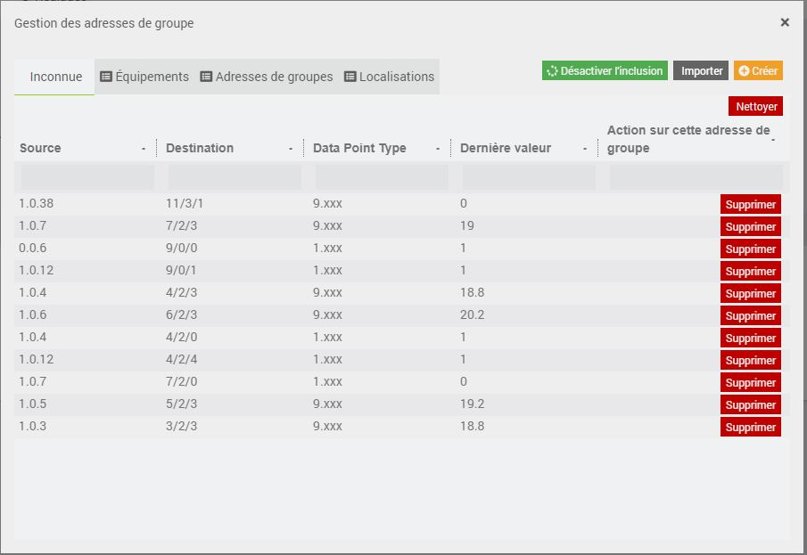
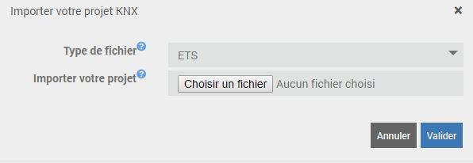

Description 
===========
Ce plugin permet de communiquer entre Jeedom et votre installation KNX.
Jeedom deviendra donc un équipement de votre installation.
Des fonctions d'auto-configuration (auto-include, parser ETS5) ont été implémentées pour permettre une mise en place rapide.

Installation et configuration
===========

Configuration du plugin et de ses dépendances
----------------------------------------------

* `Interface de communication` : Choisir l'interface avec laquelle nous allons nous connecter au bus
  * `EIBD` : N'est plus maintenu (non recommandé)
  * `KNXd` : Reprise d'EIBD et maintenu (recommandé) 
  * `Manuel` : si EIBD est installé sur une autre machine
  
### Manuel
* `Adresse IP` : Indiquez l'adresse IP de la machine sur lequel tourne EIBD.
* `Port` : Indiquez le port de connexion EIBD (Par défaut 6720)

### KNXd ou EIBD
* `Type de passerelle` : Indiquez le type de passerelle
* `Adresse de la passerelle` : Indiquez l'adresse IP de la passerelle
* `Adressage des connexions` : Personnalisez l'adresse physique du démon sur votre réseau KNX

### Options
* `Niveau d'adresse de groupe (GAD)` : Sélectionnez le niveau de GAD choisi lors de la programmation des équipements

> Pensez à sauvegarder.

Configuration avancée 
---------------------

* `Nom du serveur KNX` : donne un nom au service KNXd quand il est utilisé (uniquement pour KNXd donc)

* `Adresse Physique du démon (PA)` : permet de fixer le début d'une plage d'adresses physiques (libres !) au démon sur votre bus KNX.
Le paramètre suivant défini aussi la taille de cette plage
* `Nombres de connexions autorisées sur le serveur du démon` : donne le nombre de connexions autorisées.
Attention, ces connexions sont aussi mappées sur votre bus KNX (voir paramètre précédent)

* `Visibilité du serveur KNX` : le serveur KNX virtuel répond a une requête permettant de découvrir les passerelles par un multicast IP dédié au KNX (224.0.23.12).
Cette fonctionnalité est présente dans ETS et liste automatiquement toutes les passerelles sur le réseau locale. En désactivant cette option, le démon ne répondra plus.

* `Mode Routing` et `Mode Tunnelling` : permet au démon de devenir un router KNX virtuel.
Le mode Routing permet d’écouter et de réponde au multicast IP dédié au KNX (224.0.23.12)
Le mode Tunnelling permet de se connecter depuis un client IP comme ETS vers le BUS en passant par le démon. 
Utile si la passerelle IP n’autorise qu’une connexion simultanée et si elle est déjà utilisée par Jeedom.

Installation des dépendances
----------------------------
Pour faciliter la mise en place des dépendances, Jeedom va gérer seul l'installation de la suite logicielle EIBD/KNXd.

Dans la cadre réservé aux dépendances, vous allez voir le statut de l'installation.
Vous avez aussi la possibilité de consulter le log d'installation en temps réel
L'installation d'EIBD/KNXd peut être longue en fonction des performances de la machine qui l'exécute.
Attention, la compilation est gourmande en ressources et peut entrainer des ralentissements dans votre Jeedom

Si tous les voyants sont au vert, nous pouvons passer à la suite...

Équipement
===========
Dans un premier temps, il faut créer un nouvelle équipement et le nommer.
Comme dans tous les plugins Jeedom, vous avez un bouton "Ajouter" sur la gauche de votre fenêtre.

Ce nouvel équipement a besoin d'être paramétré.

* Nom de l'équipement KNX : Le nom a déjà été paramétré mais vous avez la possibilité de la changer
* Adresse Physique de l'équipement : cette élément n'est pas très important et peut être laissé vide
* Objet parent : Ce paramétré permet d'ajouter l'équipement dans un objet Jeedom
* Catégorie : Déclare l'équipement dans une catégorie
* Visible : Permet de rendre l'équipement visible dans le Dashboard
* Activer : Permet d'activer l'équipement
* Délai max entre 2 messages: ce champ est utile pour les équipements qui fonctionnent sur batterie, il indique a Jeedom le délai qu'il doit laisser entre 2 messages avant de vous informer d'un risque de panne.

Commande
===========

Maintenant que votre équipement est créé et configuré, vous allez pouvoir y ajouter des commandes.
Pour une bonne intégration, il est recommandé d’utiliser les templates qui créeront automatiquement toutes les commandes nécessaires pré-configurées avec leurs Flags

Exemple de configuration

Nommer votre commande de manière à la retrouver facilement dans Jeedom

Configuration KNX
---
Ces champs de configuration sont importants pour la communication 
* Data Point Type (DPT) : ce champ est important et indispensable pour l'encodage et décodage de la valeur.
* Groupe d’adresse : ce champs identifie la commande sur le bus et sur Jeedom

Valeur
---
* Retour d'état : Ce paramètre est visible pour une commande de type action, elle permet a Jeedom de lier une info à une action
* Valeur : Imposer une valeur a votre commande (lorsque l'on est en type action)
* Inverser : Cette commande permet d'inverser la valeur 

Paramètre
---
* Type : Sélectionnez le type de commande
* Sous type automatique : Laissez le plugin choisir le sous-type le plus adapté a votre DPT
* Sous Type : Choisissez le sous type le plus adaptée à la valeur transmise ou à transmettre
* Visible : Permet de rendre visible votre commande sur le Dashboard
* Historiser : Permet d'enregistrer la valeur

Enfin, pensez à sauvegarder.

Utilisation des Templates
=========================
Il existe dans le plugin plusieurs templates.
Ceux-ci vous permettent de configurer rapidement un équipement.

Création d'un équipement par template
---

Sur la page principale, un bouton "Template" permet d'ajouter un équipement .
Il vous suffit de sélectionner le template et de saisir les GAD, ou d’aller chercher les GAD importés par ETS ou dans l'onglet "Inconnue".

Création de commandes par template
---

Sélectionner une template et appliquez le.
Le plugin ajoutera et configurera les commandes définies par le template, il ne vous restera plus qu'à configurer les GAD

Ce mode est pratique si, par exemple, dans un même équipement vous voulez ajouter plusieurs templates

Flags
=====

Flag  Lecture / Read
--------------------

* Actif : Si le participant voit sur le bus un télégramme de type "Lecture / Read" qui correspond à cet objet (= l'objet est lié à l'adresse de groupe de destination du télégramme) alors le participant va répondre en envoyant sur le bus la valeur actuelle de l'objet.
* Inactif : Le participant ne réagira à aucun télégramme de type "Lecture / Read" qui correspond à cet objet.

Pour chaque adresse de groupe, au maximum UN seul objet doit avoir son flag "Lecture/Read" actif, tous les autre objet de cette même adresse de groupe doivent être inactifs, sinon une interrogation de la valeur donnerait plus d'une réponse qui pourraient être discordantes.

En général, la valeur stockée ou utilisée par les objets faisant partie d'une même adresse de groupe représente une information correspondant à quelque chose de réel / physique / mesurable dans votre maison.
Pour déterminer lequel de tous les objets faisant partie de la même adresse de groupe doit être celui qui aura son flag "Lecture/Read" actif, il faut vous demander lequel de tous ces objets a le plus de chance d'être en phase avec la réalité.
Cas simple : 3 boutons poussoir et un relais qui allume ou éteint une lampe, c'est la valeur de l'objet du relais qui représentera réellement l'état (allumé ou éteint) de la lampe, surtout après une panne de courant ou un problème sur le bus...

Flag  Écriture / Write
----------------------

* Actif : La valeur de cette commande sera modifiée si un participant envoie sur le bus un télégramme de type "Écriture/Write" qui
correspond à cet objet (= l'objet est lié à l'adresse de groupe de destination du télégramme).
* Inactif : La valeur de cet objet NE sera PAS modifiée, même si un participant envoie sur le bus un télégramme de type "Écriture/Write" qui correspond à cet objet.

Pour une valeur d'adresse de groupe, plusieurs objets peuvent avoir leur flag "Écriture/Write" actif.
N'importe quel objet dont la valeur doit pouvoir être modifiée par un autre doit avoir sun flag "Écriture/Write" actif.

Exemples d'objets pour lesquels le flag "Écriture/Write" est généralement actif :
* En général, tous les commande de type info.

Exemples d'objets pour lesquels le flag "Écriture/Write" est généralement INACTIF :
* En général, tous les commande de type action.

Flag  Transmission / Transmit
-----------------------------

* Actif : Si pour une raison quelconque (sauf la réception d'un télégramme « Écriture/Write » vers cet objet) la valeur de cette commande venait à être modifiée, le participant va envoyer sur le bus un télégramme de type "Écriture/Write" contenant la nouvelle valeur, vers la première adresse de groupe liée à cet objet.
* Inactif : Le participant n'envoie aucun télégramme sur le bus quand le retour d'etat est modifiée.

Exemples d'objets pour lesquels le flag "Transmission/Transmit" est généralement actif.
* Si la commande est de type action
* Si le retour d'etat de la commande n'est pas un capteur KNX

Exemples d'objets pour lesquels le flag "Transmission/Transmit" est généralement inactif.
* Si le retour d'etat porte la même adresse de groupe.

Flag  Mise-à-jour/Update
------------------------

* Actif : Si un autre participant répond à un télégramme de type "Lecture de la valeur" qui correspond à cet objet (= l'objet est lié à l'adresse de groupe de destination du télégramme) en envoyant une valeur différente de celle actuellement stockée dans l'objet, la valeur de l'objet est remplacée par celle lue sur le bus dans le télégramme de réponse. (= Les télégrammes de réponse de valeur sont interprétés comme instruction d'écriture).
* Inactif : Le participant ne modifie pas la valeur de son objet tant qu'il ne reçoit pas un télégramme "Écriture/Write".

En théorie, ce flag ne semble pas très utile, mais en pratique, si il est actif il permet de "re-synchroniser" plus rapidement tous les participants d'un bus quand certains ont été redémarrés ou qu'une coupure est survenue sur le bus (arrêt temporaire d'une liaison entre 2 étages ou 2 bâtiments par exemple), dans ce cas, il suffit de lancer un script qui lit tous les groupes et hop tout est resynchronisé.

Exemples d'objets pour lesquels le flag "Mise-à-jour/Update" est généralement actif :
* Si la commande est de type info
* Si le flag "Écriture/Write" actif.

Exemples d'objets pour lesquels le flag "Mise-à-jour/Update" est généralement inactif :
* Tous les commande qui ont le flag "Lecture/Read" actif.
* Tous les commande qui ont un type action

Flag  Read-on-Init / Initialisation
-----------------------------------

* Actif : Au démarrage du Bus Monitor, un télégramme de type "Lecture de la valeur" qui correspond à cet objet sera envoyé sur le bus qui mettera à jour Jeedom
* Inactif : Pas de mise a jour.

Exemples d'objets pour lesquels le flag "Read-on-Init/Initialisation" est généralement actif :
* Si la commande est de type info
* Si le flag "Écriture/Write" actif.

Exemples d'objets pour lesquels le flag "Read-on-Init/Initialisation" est généralement inactif :
* Tous les commande qui ont le flag "Lecture/Read" actif.
* Tous les commande qui ont un type action

Utilisation du Bus Monitor
==========================

En cliquant sur l'icône ci-dessous, vous allez pouvoir visualiser l'activité qui se passe sur votre bus.
Pour le débogage d'une configuration défaillante, il est aussi possible de filtrer les messages enregistrés en mémoire cache.

Avec le Bus Monitor vous allez pouvoir analyser ce qui se passe sur votre bus et ce que comprend Jeedom au bus.

Le Bus Monitor affiche l'adresse physique de l’équipement, l'adresse de groupe, la data en hexa et sa conversion

Adresses de groupe
==================

Cette fenêtre est disponible à plusieurs endroits.

* Sur la page principal
* Sur chaque bouton pour la sélection (Template et commande)

En cliquant sur un des ses bouton vous allez obtenir cette fenêtre.

Inconnue
--------

Cette onglet permet de remonter les GAD inconnue vue par le Bus Monitor.
En activant l'inclusion, le Bus Monitor vas mettre en cache également tous les GAD qu'il voit et qui sont inconnue a votre installation.
De même, si vous avez configurer les DPT dans votre projet ETS, et l'adresse physique de votre équipement dans votre configuration Jeedom, un filtre sera automatiquement ajouté pour faciliter les recherches

Équipement
----------

Cette onglet permet de lister tous les GAD avec leurs équipements.
Pour que remplir ce tableau, il est impératif d'utiliser le parseur ETS.
Si vous avez ouvert cette fenêtre depuis un bouton de selection de GAD, alors vous aurez la possibilité de sélectionner le bon GAD (qui se mettra en gras) et de valider pour retourner à la page de configuration.
De même, si vous avez configuré les DPT dans votre projet ETS, et l'adresse physique de votre équipement dans votre configuration Jeedom, un filtre sera automatiquement ajouté pour faciliter les recherches

Adresse de groupes
------------------

Cette onglet permet de récréer l'arborescence de GAD tel qu'elle est défini dans ETS.
Pour que remplir ce tableau, il est impératif d'utiliser le parseur ETS.

Si vous avez ouvert cette fenêtre depuis un bouton de selection de GAD, alors vous aurez la possibilité de sélectionner le bon GAD (qui se mettra en gras) et de valider pour retourner à la page de configuration.
De même, si vous avez configuré les DPT dans votre projet ETS, le plugin vous soulignera en bleu lorsque le DPT est identique et en jaune lorsqu'il est compatible

Utilisation du parseur ETS
==========================

En téléchargeant votre projet ETS (.KNXproj), vous allez permettre à Jeedom de charger dans son cache, tout les GAD de votre installation.

Avec le parseur vous pouvez lui demander des actions supplémentaires

* Arborescence des groupes : Défini, pour chaque rang de votre arborescence de vos GAD, un type d'information. Cette configuration est obligatoire si vous voulez qu'il crée automatiquement vos objets et équipements
* Créer les objets : Le parseur crée automatiquement, s'ils n'existent pas, les objets définis dans le rang d'arborescence de vos GAD
* Créer les équipements  : Le parseur crée automatiquement, s'il n'existe pas, vos équipements tels que définis dans le rang d'arborescence de vos GAD. Il sera toutefois impératif de reprendre la configuration de chacun car le fichier ETS ne le définit pas tout.
* Uniquement correspondant a un Template : Cette option permet de créer un équipement qui corresponde à un Template. Pour que le plugin puisse identifier le template et ses commandes, l'architecture de GAD de votre projet doit correspondre exactement au projet ETS.[Voici un exemple]: https://github.com/mika-nt28/Jeedom-EIBD/raw/master/docs/images/Jeedom_Template.KNXproj
* Importer votre projet : Champs d'import de votre projet ETS (.KNXproj)

Utilisation de la passerelle Jeedom/KNX
=======================================
Pour être au plus proche du KNX, le plugin peut se comporter comme un participant.
On peut donc configurer le plugin pour qu'il réalise des actions automatiquement.

Envoyer une valeur sur le bus. 
-----------------------------

Vous avez sur Jeedom un capteur qui n'est pas KNX, mais vous souhaiteriez le lier directement à votre réseau ?
Pour cela il suffit de configurer votre commande ainsi:

* Créer une commande de type "action"
* Saisir le GAD qui correspond à l'objet KNX que vous souhaitez mettre à jour
* Activer le Flag "Transmettre"
* En retour d'état allez chercher la commande de votre capteur.

Répondre à une commande "Read" en provenance du bus
----------------------------------------------------

Le plugin est capable de répondre à un interrogation du bus.
Pour cela, il suffit de configurer votre commande ainsi:

* Créer une commande de type "info"
* Saisir le GAD qui correspond à l'objet KNX que vous souhaitez surveiller
* Activer le flag "Lecture"

Mode cyclique
-------------

Vous avez besoin de lire un état ou d'envoyer une valeur sur le bus de manière cyclique (comme une horloge ou un état à une vanne thermostatique)
Rien de plus simple, il suffit de choisir une base de temps sur votre commande de type action, le plugin fait le reste.

FAQ
===

Comment créer une commande pour allumer la lumière alors que physiquement, je n'ai pas d’interrupteur ?  
-------------------------------------------------------------------------------------------------------
Sous Jeedom, nous pouvons créer des interrupteurs virtuels en configurant une commande de type action.
Les éléments importants pour envoyer des informations sur le bus avec Jeedom sont :

* Adresse de groupe
* Le DPT pour son encodage
On verra apparaître sur le Bus Monitor la commande envoyée avec l'adresse physique d'EIBD

Je n'arrive pas a émettre une information avec ma passerelle Hager th102 ?
---------------------------------------------------------------------------
Le script de démarrage fonctionne mal avec cette passerelle.
Il faut utiliser cette ligne pour lancer EIBD

> EIBD -D -S -T -t1023 -i usb:1:6:1:0:0 -e 1.1.128 -R -u
